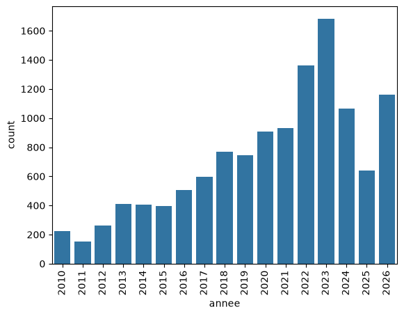
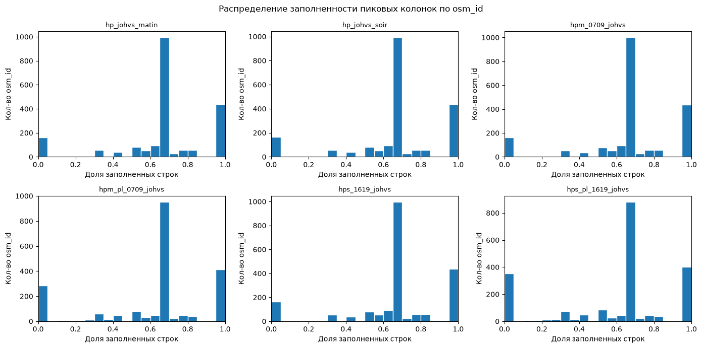
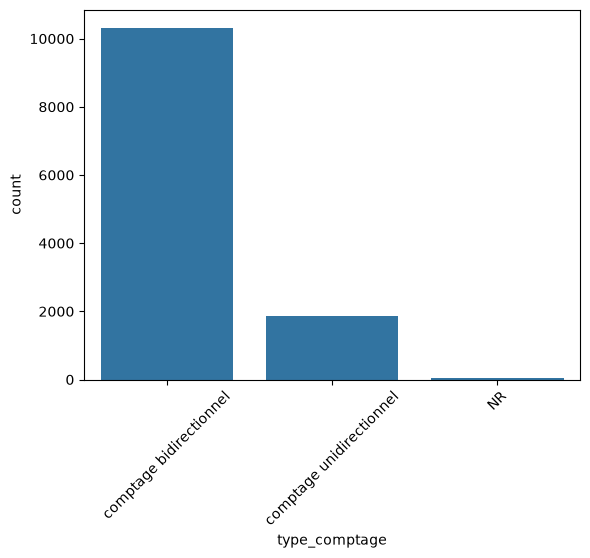
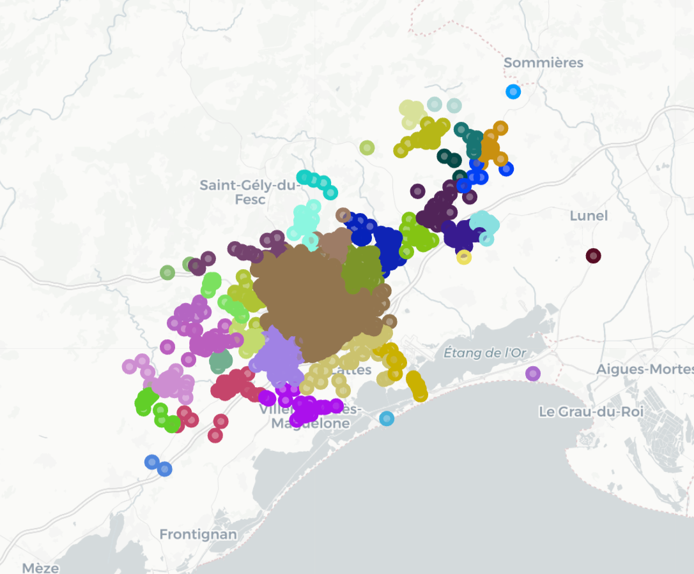
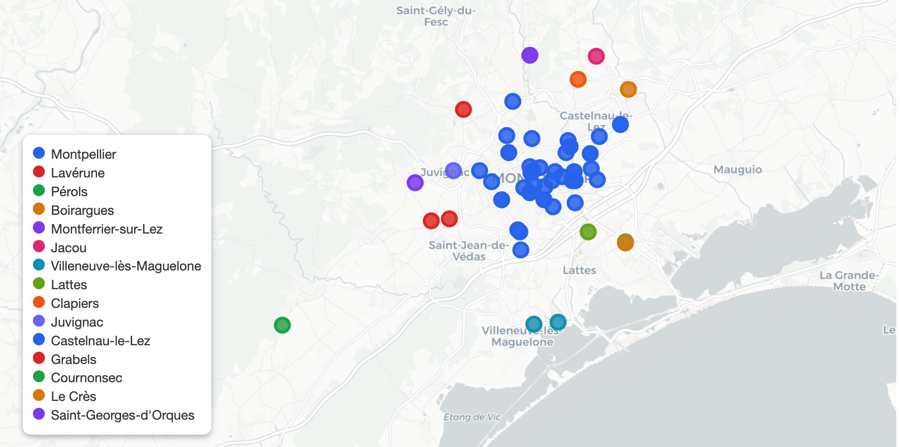

# 1. Автомобильные счётчики

## Объём данных

Всего уникальных записей: **12 211**  
Всего уникальных сечений: **2 081**

## Привязка к сети (id_osm)

Доля записей с непустым `id_osm`: **100%**

## Свежесть данных

Сечений, измеренных после 2020 года: **1 426 / 2 081**

## Полнота пиковых значений

| Показатель | Доля заполненных |
|---|---|
| `hp_johvs_matin` | 66.8% |
| `hp_johvs_soir` | 66.7% |
| `hpm_0709_johvs` | 66.9% |
| `hpm_pl_0709_johvs` | 61.2% |
| `hps_1619_johvs` | 66.8% |
| `hps_pl_1619_johvs` | 58.5% |

## Распределение сечений по типам

| Тип счётчика | Количество |
|---|---|
| `compteur ponctuel` | 1 843 |
| `compteur permanent` | 56 |
| `compteur feux` | 55 |
| `compteur permanent vélo` | 46 |
| `compteur tournant` | 39 |
| `compteur ponctuel vélo` | 9 |
| Комбинированные типы | 31 |

## Направленность измерений

| Тип учёта | Количество |
|---|---|
| Двунаправленный | 10 326 |
| Однонаправленный | 1 853 |
| Не указано | 32 |

## Географическое покрытие

| Коммуна | Записей  |
|---|----------|
| Montpellier | 7 823    |
| Castelnau-le-Lez | 441      |
| Lattes | 396      |
| Saint-Jean-de-Védas | 330      |
| Le Crès | 252      |
| Villeneuve-lès-Maguelone | 206      |
| Pignan | 203      |
| Lavérune | 197      |
| Fabrègues | 196      |
| Vendargues | 191      |
| Grabels | 189      |
| Montferrier-sur-Lez | 149      |
| Baillargues | 144      |
| Castries | 141      |
| Cournonterral | 127      |
| Juvignac | 121      |
| Saint-Drézéry | 120      |
| Cournonsec | 113      |
| Pérols | 103      |
| Jacou | 97       |
| Clapiers | 90       |
| Saint-Geniès-des-Mourgues | 76       |
| Montaud | 75       |
| Saussan | 73       |
| Saint-Brès | 56       |
| Saint-Georges-d'Orques | 52       |
| Murviel-lès-Montpellier | 52       |
| Sussargues | 52       |
| Restinclières | 45       |
| Beaulieu | 35       |
| Prades-le-Lez | 20       |
| Saint-Jean-de-Cornies | 12       |
| Mudaison | 6        |
| Montarnaud | 6        |
| Gigean | 6        |
| Mauguio | 3        |
| Guzargues | 3        |
| Saussines | 3        |
| Marsillargues | 3        |
| La Grande-Motte | 3        |
| Palavas-les-Flots | 1        |

Доля подходящих сечений — более 50%.

---

# 2. Эко-счётчики (вело, пешеходы)

## Активные счётчики

Активно сейчас: **60 счётчиков**

## Временной охват по каждому счётчику

| № | Серийный номер | Начало ряда | Конец ряда |
|---|---|---|---|
| 0 | X2H20104132 | 2020-11-12 | 2026-07-28 |
| 1 | X2H19070220 | 2020-12-17 | 2026-08-10 |
| 2 | XTH19101158 | 2020-12-17 | 2026-08-10 |
| 3 | X2H21070341 | 2021-12-17 | 2026-08-01 |
| 4 | X2H21070343 | 2021-12-17 | 2026-08-10 |
| 5 | X2H21070344 | 2021-12-17 | 2026-07-14 |
| 6 | X2H21070345 | 2021-12-17 | 2026-08-10 |
| 7 | X2H21070346 | 2021-12-17 | 2026-08-10 |
| 8 | X2H21070347 | 2021-12-17 | 2026-02-27 |
| 9 | X2H21070348 | 2021-12-17 | 2025-09-22 |
| 10 | X2H21070349 | 2021-12-17 | 2026-08-10 |
| 11 | XTH21015106 | 2021-12-17 | 2026-08-10 |
| 12 | X2H21111121 | 2022-01-20 | 2026-08-10 |
| 13 | X2H22043029 | 2022-06-13 | 2026-08-10 |
| 14 | X2H22043030 | 2022-06-13 | 2026-08-10 |
| 15 | X2H22043031 | 2022-06-13 | 2026-08-10 |
| 16 | X2H22043032 | 2022-06-13 | 2026-08-10 |
| 17 | X2H22043033 | 2022-06-13 | 2026-08-10 |
| 18 | X2H22043034 | 2022-06-13 | 2026-05-01 |
| 19 | X2H22043035 | 2022-06-13 | 2026-08-10 |
| 20 | X2H22104765 | 2022-12-15 | 2026-08-10 |
| 21 | X2H22104766 | 2022-12-15 | 2026-08-10 |
| 22 | X2H22104767 | 2022-12-15 | 2026-08-10 |
| 23 | X2H22104768 | 2022-12-15 | 2026-08-10 |
| 24 | X2H22104769 | 2022-12-15 | 2026-08-10 |
| 25 | X2H22104770 | 2022-12-15 | 2026-08-10 |
| 26 | X2H22104773 | 2022-12-15 | 2026-08-10 |
| 27 | X2H22104774 | 2022-12-15 | 2026-08-10 |
| 28 | X2H22104775 | 2022-12-15 | 2026-08-10 |
| 29 | X2H22104776 | 2022-12-15 | 2026-08-10 |
| 30 | X2H22104771 | 2023-01-03 | 2026-02-07 |
| 31 | X2H22104777 | 2023-01-03 | 2026-08-10 |
| 32 | XTH24072390 | 2024-08-05 | 2026-07-19 |
| 33 | ZLT25011699 | 2025-06-16 | 2026-08-10 |
| 34 | COM23120110 | 2025-07-02 | 2026-08-10 |
| 35 | COM23120112 | 2025-07-02 | 2026-08-10 |
| 36 | COM23120113 | 2025-07-02 | 2026-08-10 |
| 37 | COM23120114 | 2025-07-02 | 2026-08-10 |
| 38 | COM23120117 | 2025-07-02 | 2026-08-10 |
| 39 | COM24010120 | 2025-07-02 | 2026-08-10 |
| 40 | COM24010119 | 2026-01-13 | 2026-07-21 |
| 41 | COM24010121 | 2026-01-13 | 2026-08-10 |
| 42 | ZLT25112669 | 2026-01-13 | 2026-08-10 |
| 43 | ZLT25112692 | 2026-01-13 | 2026-08-10 |
| 44 | ZLT25112718 | 2026-01-13 | 2026-08-10 |
| 45 | ZLT25112719 | 2026-01-13 | 2026-08-10 |
| 46 | ZLT25112720 | 2026-01-13 | 2026-08-10 |
| 47 | X2H24042101 | 2026-01-20 | 2026-04-13 |
| 48 | X2H25023006 | 2026-03-25 | 2026-08-10 |
| 49 | COM23070049 | 2026-06-04 | 2026-08-05 |
| 50 | ZLT26063736 | 2026-07-04 | 2026-08-10 |
| 51 | ZLT26043541 | 2026-07-06 | 2026-08-10 |
| 52 | ZLT26063734 | 2026-07-06 | 2026-08-10 |
| 53 | ZLT26063735 | 2026-07-06 | 2026-08-10 |
| 54 | ZLT26063738 | 2026-07-06 | 2026-08-10 |
| 55 | Y2H20042633 | — | — |
| 56 | Y2H20042634 | — | — |
| 57 | Y2H20042635 | — | — |
| 58 | Y2H20063162 | — | — |
| 59 | Y2H20063164 | — | — |

## Пешеходный канал

Пешеходного канала нет.

## Полнота вокруг декабря 2023

Счётчиков с непрерывными данными за ±6 месяцев от декабря 2023: **32 / 60**

---

# 3. Общественный транспорт

# Проверка: существует ли ABM Монпелье

Открытой воспроизводимой агентной модели Монпелье не обнаружено ни в matsim-scenarios, ни в GitHub, ни в обзорной литературе. У метрополии существует агрегированная мультимодальная модель на зонировании из 615 зон, разработанная с Cerema — не агентная и без публичного кода. Работы по мультиагентному моделированию в регионе Окситания есть, но по Тулузе, не по Монпелье.

# Решение

Оставляем Монпелье.
